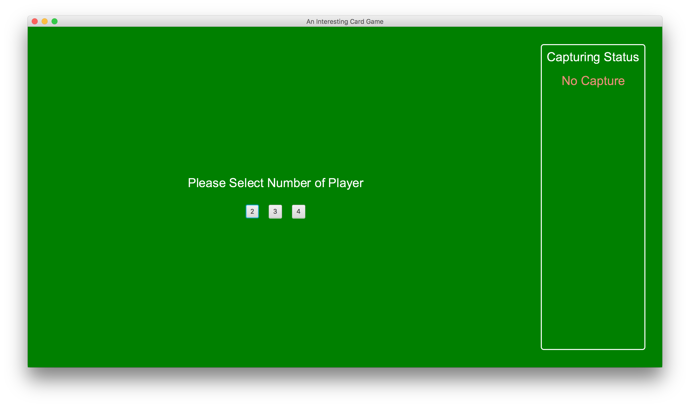
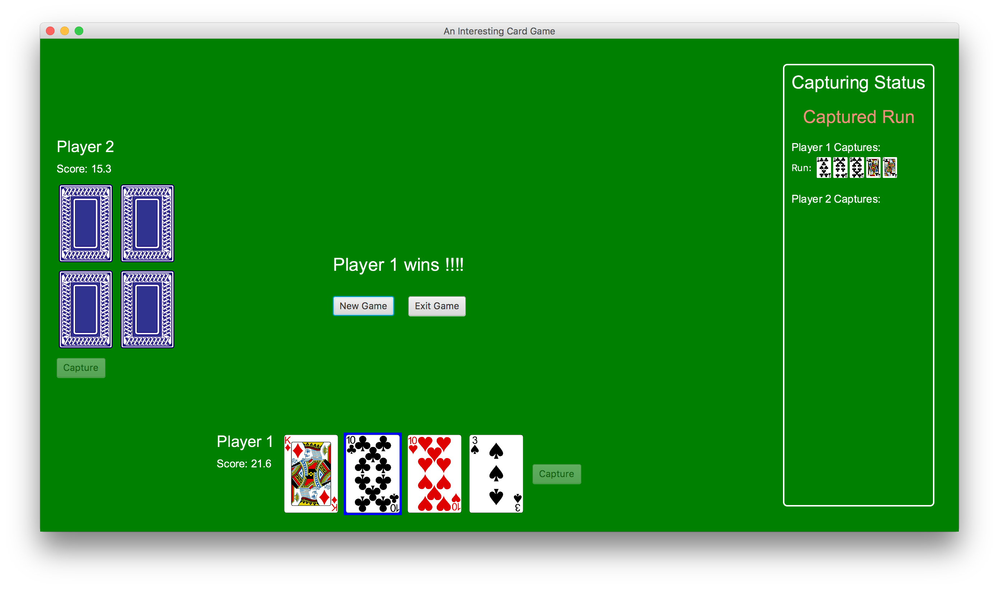
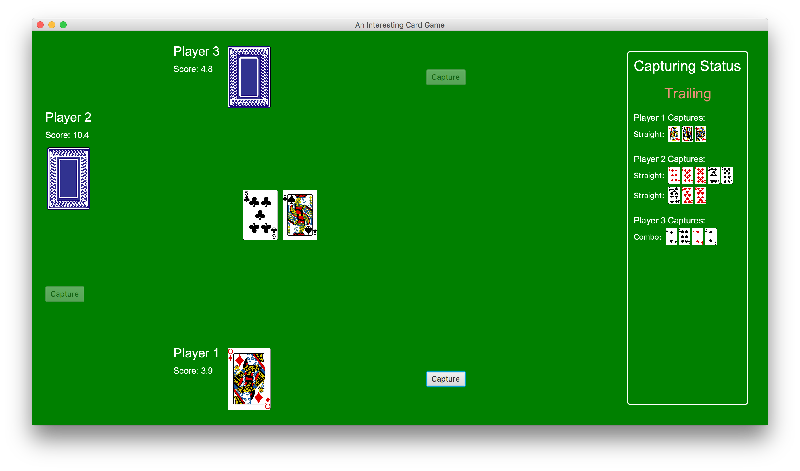
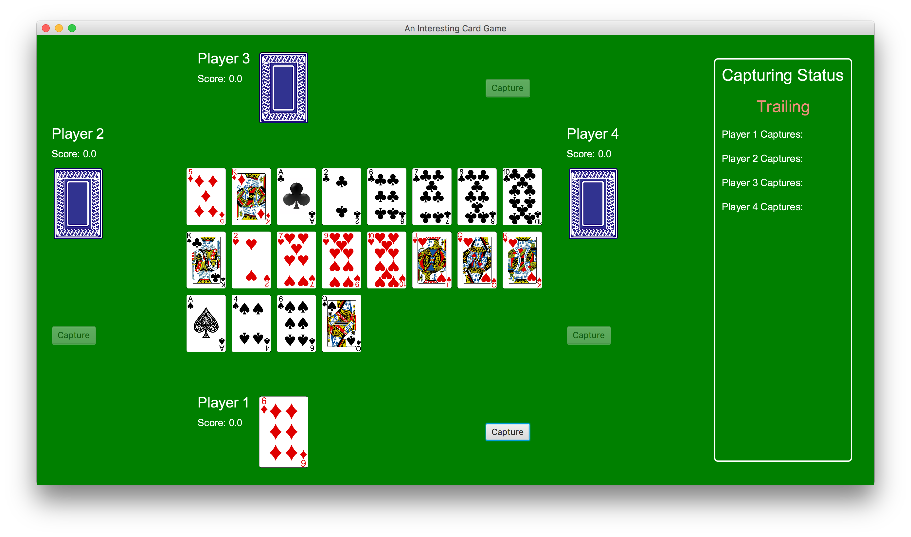

# Java Card Game
A GUI card game implemented in Java. My assignment in UCCD2044 Object-Oriented Programming Practices.

# Game Rules
The game rules are specified in [requirement.pdf](requirement.pdf).

# Prerequisite
Java, javac, JavaFX

# Compilation
```
cd src
javac *.java && jar cvfm Game.jar manifest.txt *.class ../img/ && mv Game.jar ..
```

# Running the Game
```
cd java-card-game
java -jar Game.jar
```

# Screenshot of the Game
 <br>
 <br>
 <br>
 <br>
